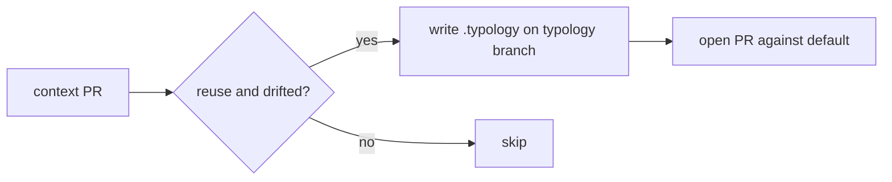
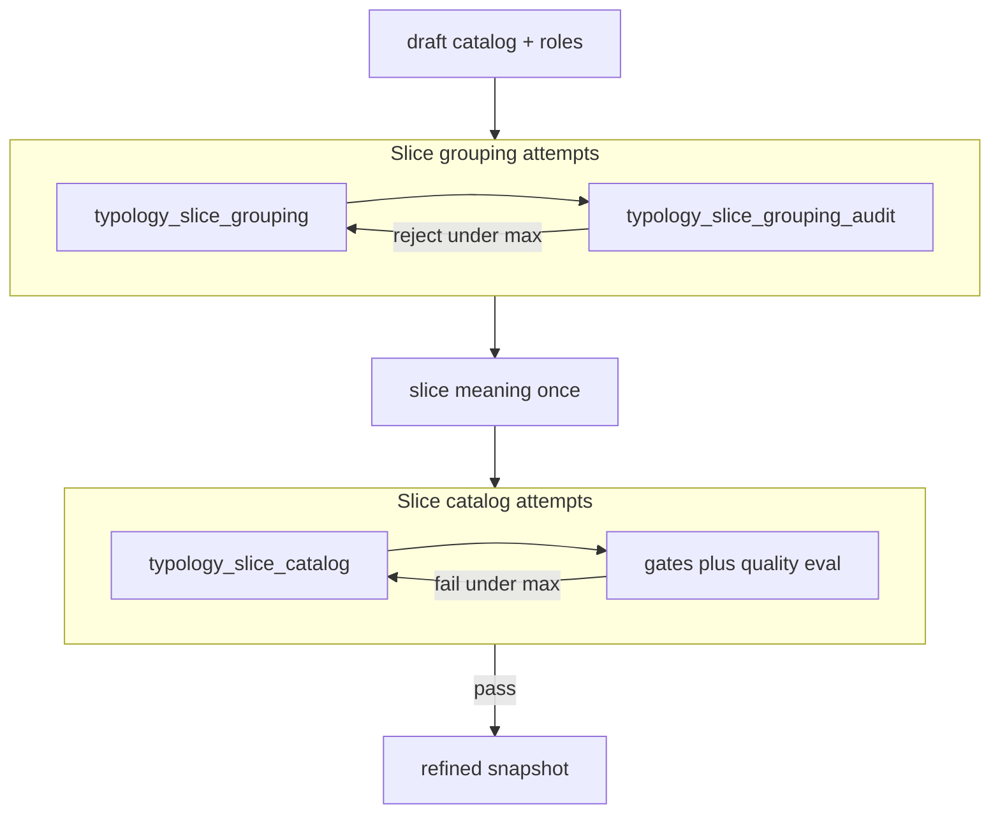
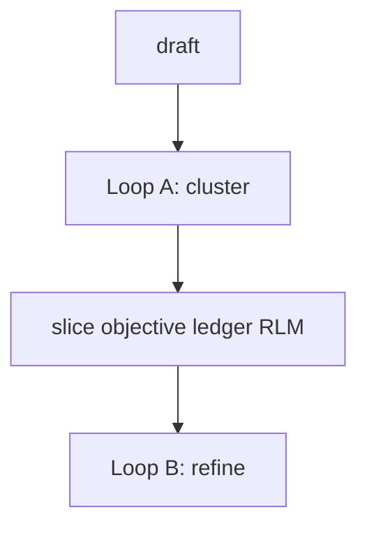

# Explain implementation

**Moral:** After you change the product, a developer must skim what landed and
how the pieces connect without reading an essay. Prefer a tight visual layout
over paragraphs. Numbered steps MUST read like readable **pseudocode**
(behavior, decisions, skips), not like a narrative.

**Voice:** Still follow `.cursor/rules/always-rules-01-human-interaction.mdc`
for the rest of the turn (no icon-prefixed reply headings). For this explain
pass only, MUST prefer scannable structure over fluent multi-sentence prose.

---

## When to load

Load and follow this skill before the final user-facing reply when **any** of:

- You edited, created, or deleted project files to implement or fix something
- You are about to say the work is done, ready to commit, or ready to PR
- The user asks what you did, how it was built, or to explain the change

MUST NOT skip because the turn also ran tests or opened a PR.

MUST NOT load this skill for pure Q&A with no file changes (unless the user
asks you to explain a prior implementation).

---

## Core constraints

**CONSTRAINT:** The post-implementation explain MUST be visual-first and short:

1. **Lead** — one line: what is different now.
2. **How it fits** — numbered **pseudocode-style steps** for the moving parts (`ON` / `IF` / `ELSE` / `IS` / `DO`). A small mermaid (or compact table) MAY replace the list or sit beside it when the flow is branching or easier to see as a diagram.
3. **Authorship** — one line/bullet only if LLM vs mechanical could be confused; otherwise omit.
4. **Evidence** — optional short path list last.

- MUST: default to numbered pseudocode steps; use a diagram when it makes the path clearer.
- MUST: keep the explain scannable in a few seconds.
- MUST: keep each step concrete enough that a cold reader knows what happens without decoding jargon (split packed phrases into two steps when needed).
- MUST: use **`ON <moment>:`** for always-on wiring or when a call runs (construction, each request, each turn). That names *when*, not a branch.
- MUST: use **`IF` / `ELSE`** only for real branches (two different outcomes).
- MUST: mark a resulting fact with **`IS`** (what is true on that path, or what is true after the change). Hang it on the `IF` or `ELSE` after the arrow when it is that path's outcome.
- MUST: mark a non-branch action with **`DO`** (work you perform that is not a choice and not a moment).
- MUST NOT: leave a bare verb that can be read as either a fact or an action. `Leave`, `bind`, and `keep` without `IS` or `DO` look like another decision.
- MUST NOT: add `THEN` or `PROCESS`. The arrow already joins the branch to `IS` or `DO`. `PROCESS` reads as a thing that exists.
- MUST NOT: write paragraph essays, restated task fluff, or empty ceremonial headings.
- MUST NOT: replace the explain with only file names or SHAs.
- MUST NOT: pack several actions into one vague line (for example “open/restack PR base=default writing X”).
- MUST NOT: chain always-on and conditional work with arrows (`A → B → C if missing`) so a reader cannot tell statement from branch.
- MUST NOT: join nouns with `/` to mean “all of these” (reads as OR). Write `and`, a comma list, or separate steps.
- Enforcement: Lead is ≤2 short sentences; body is numbered steps and/or one small diagram, not prose blocks; each step states one clear action or decision; skim for `ON` vs `IF` vs `IS` vs `DO` and for `/`-joined noun lists.
- Violation: STOP, cut prose into lead + concrete steps (and/or tiny diagram), then send.

CORRECT:
```markdown
Digest can promote a drifted confirmed typology catalog onto default via a product PR.

1. ON context digest finish: proposal stays on `majordomo-context/…`.
2. IF survey mode ≠ reuse → skip.
3. IF refined catalog == confirmed `.typology/typology.yaml` (normalized) → skip.
4. ELSE → IS refined YAML in `.typology/typology.yaml` on branch `majordomo-typology/<repo>-update`.
5. DO push that branch.
6. DO open (or update) a product PR whose base is the default branch.
7. IS that product PR left unmerged.

- Mechanical Go only (no new LLM); PR body reuses existing findings markdown.
```

CORRECT (wiring with `ON` and one real deadline branch):
```markdown
Host chat adapter builds a portable runtime; product policy stays on the host.

1. ON `NewFacade`: build runtime (store, model, clock, and host system prompt).
2. ON each owner-scoped call: map host principal → runtime owner.
3. ON each turn into the runtime: IF `ctx` has a deadline → keep it; ELSE wrap with a fixed timeout.
4. ON turn: IF intent gate requires lock and stage is not locked → fail; ELSE run the turn.
```

PROHIBITED (vague packed step):
```markdown
4. ELSE push `majordomo-typology/…-update` and open/restack PR base=default with `.typology/typology.yaml`.
```

PROHIBITED (arrow chain hides whether a step is always or conditional):
```markdown
3. Host Facade → builds Runtime → maps Principal to Owner → injects deadline if missing.
```

PROHIBITED (`/` between nouns reads as OR, not the portable bundle):
```markdown
1. IF the work is portable turn / store / assemble / harness → put it under the library.
```
Use instead: `IF the work is the portable turn, store, assemble, and harness bundle → …` (all of them).
CORRECT (flow diagram when steps alone are muddy):
```markdown
Promote runs after the context PR:



- No new LLM calls
```

PROHIBITED (prose wall):
```markdown
Digest can now open a product PR that promotes the refined typology catalog onto default when the confirmed catalog drifted. Usual digest still builds the proposal on the context branch. After that PR is opened, Go checks survey mode was reuse, compares confirmed vs refined YAML, and on drift force-pushes…
```

PROHIBITED (file dump):
```markdown
Changed typology_promote.go, run.go, poll.go.
Tests pass.
```

**CONSTRAINT:** MUST NOT use icon-prefixed headings (`✅`, `🔍`, `🧭`, `➡️`, `❓`).

- Enforcement: Scan before send.
- Violation: Rewrite without icons.

**CONSTRAINT:** Steps MUST name one concrete behavior each (compare, write, skip, push, open). Paths and branch names MAY appear, but the action MUST stay obvious. MUST NOT crush write + push + open into one opaque phrase.

- Enforcement: Read each step; ask whether a new teammate would know what git/forge action just happened.
- Violation: STOP, split or reword the step.

**CONSTRAINT:** `ON`, `IF`, `IS`, and `DO` must stay distinct.

- `ON <moment>:` = this always runs at that moment (constructor, each call, each turn).
- `IF` / `ELSE` = choose one path; two different outcomes.
- `IS` = a fact: what is true on that path, or what is true after the change. Not a choice.
- `DO` = an action that is not a choice and not a moment.
- MUST NOT: use `THEN` (the arrow is the join) or `PROCESS` (reads as a fact).
- Enforcement: Re-read steps; if a line mixes always wiring with a maybe, split into `ON` plus nested `IF`. If a bare verb could be either a fact or an action, mark `IS` or `DO`.
- Violation: STOP, rewrite with `ON`, `IF`, `IS`, and `DO` separate.

CORRECT (fact on the branch, action after it):
```markdown
Slice-free packages are a technical library; packages that still import a slice stay put.

1. IF the package imports a slice-owned package → IS on the product slice: handlers and pipelines.
2. ELSE → IS on the technical library: activity, config, and leaf adapters.
3. DO bind that library to the foundation library, and bind each slice that imports it.
```

PROHIBITED (bare verbs hide fact vs action, so both look like decisions):
```markdown
3. Bind the library to the foundation library.
4. Leave handlers and pipelines on the product slice.
```

---

## Loop diagrams

**CONSTRAINT:** When a mermaid (or similar) diagram includes one or more loops, it MUST show **what is inside each loop** versus what runs once outside.

- MUST: draw each loop as a `subgraph` whose interior lists the repeated steps and the retry edge.
- MUST: place once-only steps outside every loop subgraph.
- MUST NOT: use a lone box labeled `Loop A` / `Loop B` on a straight line.
- For Majordomo typology digest, MUST use domain names: **slice grouping**, **slice meaning** (once, between loops), **slice catalog** (see `.cursor/rules/typology-slice-domain.mdc`).
- Enforcement: Every loop node has a subgraph + retry edge; once-only neighbors sit outside.
- Violation: STOP, redraw, then send.

CORRECT (boundaries clear: meaning is outside both loops):


PROHIBITED (ambiguous membership; jargon stage names):


---

## Agent procedure

1. **Detect** — File-changing implement/fix, or user asked what you did.
2. **Lead line** — Outcome only.
3. **Pseudocode steps** — How it is put together; `ON` for when, `IF`/`ELSE` for branches, `IS` for facts, `DO` for non-branch actions; add or swap in a small diagram when the flow is clearer that way; cut anything that does not help scanning.
4. **If diagram has loops** — Subgraphs + in-loop retry; domain names for typology stages.
5. **One authorship bullet** — Only if confusable.
6. **Optional paths** — Last, short.
7. **Stop** — No essay. One next-step question is fine.

---

## Pre-completion checklist

- [ ] **Visual-first:** Lead + numbered steps (diagram optional); not a prose wall
      Method: Count long paragraphs in the explain
      Pass: At most one short lead; body is steps and/or one small diagram
      Fail: STOP, convert to numbered steps (and/or tiny diagram)
- [ ] **Enough:** Cold reader gets what changed and how it fits
      Method: Skim-only test (~5 seconds)
      Pass: Both clear
      Fail: STOP, add the missing beat as a step
- [ ] **Not a file dump:** Behavior verbs present
      Method: Read steps
      Pass: System behavior first
      Fail: STOP, rewrite
- [ ] **Concrete steps:** No packed vague lines; each step is one clear action/decision
      Method: Teammate test on each step
      Pass: Action is obvious without decoding jargon
      Fail: STOP, split or reword
- [ ] **ON vs IF vs IS vs DO:** Moments use `ON`; only real branches use `IF`/`ELSE`; facts use `IS`; non-branch actions use `DO`
      Method: Skim for bare verbs and for arrow chains that pack “if missing” into a statement
      Pass: When, branch, fact, and action are obvious
      Fail: STOP, mark `ON`, `IF`, `IS`, or `DO`
- [ ] **No `/` as AND:** Noun lists use `and` or commas, not slash joins that read as OR
      Method: Grep steps for ` / `
      Pass: Bundle membership is unambiguous
      Fail: STOP, reword
- [ ] **Loop diagram clarity:** If the diagram names loops, each has a subgraph + retry edge; once-only steps sit outside
      Method: Inspect mermaid for subgraphs and feedback arrows
      Pass: Membership of each node is obvious
      Fail: STOP, redraw
- [ ] **No icon template / no fluff**
      Method: Scan
      Pass: Clean and short
      Fail: STOP, cut
