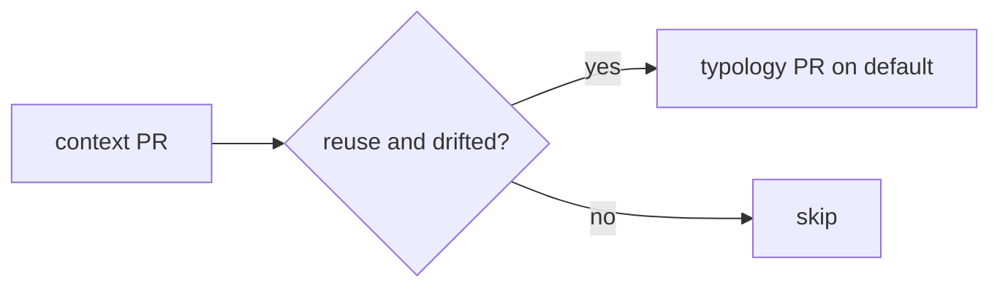

# Explain implementation

**Moral:** After you change the product, a developer must skim what landed and
how the pieces connect without reading an essay. Prefer a tight visual layout
over paragraphs.

**Voice:** Still follow `.cursor/rules/always-rules-01-human-interaction.mdc`
for the rest of the turn (no icon-prefixed reply headings). For this explain
pass only, MUST prefer scannable structure over fluent multi-sentence prose.

---

## When to load

Load and follow this skill before the final user-facing reply when **any** of:

- You edited, created, or deleted project files to implement or fix something
- You are about to say the work is done, ready to commit, or ready to PR
- The user asks what you did, how it was built, or to explain the change

MUST NOT skip because the turn also ran tests or opened a PR.

MUST NOT load this skill for pure Q&A with no file changes (unless the user
asks you to explain a prior implementation).

---

## Core constraints

**CONSTRAINT:** The post-implementation explain MUST be visual-first and short:

1. **Lead** — one line: what is different now.
2. **How it fits** — numbered **step-by-step** for the moving parts (inputs → decisions → outputs). A small mermaid (or compact table) MAY replace the list or sit beside it when the flow is branching or easier to see as a diagram.
3. **Authorship** — one line/bullet only if LLM vs mechanical could be confused; otherwise omit.
4. **Evidence** — optional short path list last.

- MUST: default to numbered steps; use a diagram when it makes the path clearer.
- MUST: keep the explain scannable in a few seconds.
- MUST NOT: write paragraph essays, restated task fluff, or empty ceremonial headings.
- MUST NOT: replace the explain with only file names or SHAs.
- Enforcement: Lead is ≤2 short sentences; body is numbered steps and/or one small diagram, not prose blocks.
- Violation: STOP, cut prose into lead + steps (and/or tiny diagram), then send.

CORRECT:
```markdown
Digest can promote a drifted confirmed typology catalog onto default via a product PR.

1. Context digest finishes as usual (proposal on `majordomo-context/…`).
2. If mode is `reuse` and refined ≠ confirmed → push `majordomo-typology/…-update`.
3. Open/restack PR **base = default** writing `.typology/typology.yaml`.
4. Skip on discover / local seed; never auto-merge.

- Mechanical Go only (no new LLM); PR body reuses existing findings markdown.
```

CORRECT (flow diagram when steps alone are muddy):
```markdown
Promote runs after the context PR:



- Payload: refined YAML → `.typology/typology.yaml`
- No new LLM calls
```

PROHIBITED (prose wall):
```markdown
Digest can now open a product PR that promotes the refined typology catalog onto default when the confirmed catalog drifted. Usual digest still builds the proposal on the context branch. After that PR is opened, Go checks survey mode was reuse, compares confirmed vs refined YAML, and on drift force-pushes…
```

PROHIBITED (file dump):
```markdown
Changed typology_promote.go, run.go, poll.go.
Tests pass.
```

**CONSTRAINT:** MUST NOT use icon-prefixed headings (`✅`, `🔍`, `🧭`, `➡️`, `❓`).

- Enforcement: Scan before send.
- Violation: Rewrite without icons.

**CONSTRAINT:** Steps MUST name behavior (compare, write, skip, open), not only symbols. Paths MAY trail a behavior step.

- Enforcement: Each numbered step has a verb about what the system does.
- Violation: STOP, rewrite as behavior steps.

---

## Agent procedure

1. **Detect** — File-changing implement/fix, or user asked what you did.
2. **Lead line** — Outcome only.
3. **Numbered steps** — How it is put together; add or swap in a small diagram when the flow is clearer that way; cut anything that does not help scanning.
4. **One authorship bullet** — Only if confusable.
5. **Optional paths** — Last, short.
6. **Stop** — No essay. One next-step question is fine.

---

## Pre-completion checklist

- [ ] **Visual-first:** Lead + numbered steps (diagram optional); not a prose wall
      Method: Count long paragraphs in the explain
      Pass: At most one short lead; body is steps and/or one small diagram
      Fail: STOP, convert to numbered steps (and/or tiny diagram)
- [ ] **Enough:** Cold reader gets what changed and how it fits
      Method: Skim-only test (~5 seconds)
      Pass: Both clear
      Fail: STOP, add the missing beat as a step
- [ ] **Not a file dump:** Behavior verbs present
      Method: Read steps
      Pass: System behavior first
      Fail: STOP, rewrite
- [ ] **No icon template / no fluff**
      Method: Scan
      Pass: Clean and short
      Fail: STOP, cut
