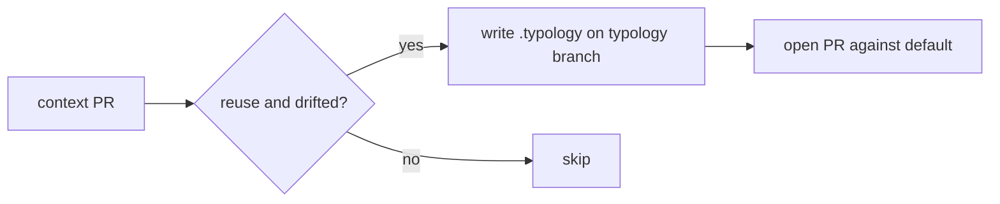
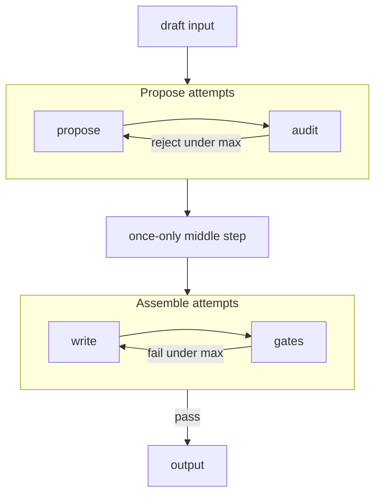
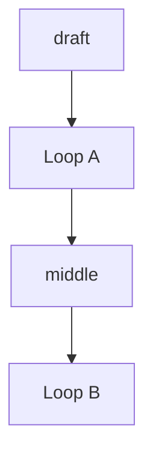

# Explain implementation

**Moral:** After you change the product, a developer must skim what landed and
how the pieces connect without reading an essay. Prefer a tight visual layout
over paragraphs. Numbered steps MUST read like readable **pseudocode**
(behavior, decisions, skips), not like a narrative.

**Voice:** Still follow `.cursor/rules/always-rules-01-human-interaction.mdc`
for the rest of the turn (no icon-prefixed reply headings). For this explain
pass only, MUST prefer scannable structure over fluent multi-sentence prose.

---

## When to load

Load and follow this skill before the final user-facing reply when **any** of:

- You edited, created, or deleted project files to implement or fix something
- You are about to say the work is done, ready to commit, or ready to PR
- The user asks what you did, how it was built, or to explain the change

MUST NOT skip because the turn also ran tests or opened a PR.

MUST NOT load this skill for pure Q&A with no file changes (unless the user
asks you to explain a prior implementation).

---

## Core constraints

**CONSTRAINT:** The post-implementation explain MUST be visual-first and short:

1. **Lead** — one line: what is different now.
2. **How it fits** — numbered **pseudocode-style steps** for the moving parts (`IF` / `ELSE` / skip / write / open). A small mermaid (or compact table) MAY replace the list or sit beside it when the flow is branching or easier to see as a diagram.
3. **Authorship** — one line/bullet only if LLM vs mechanical could be confused; otherwise omit.
4. **Evidence** — optional short path list last.

- MUST: default to numbered pseudocode steps; use a diagram when it makes the path clearer.
- MUST: keep the explain scannable in a few seconds.
- MUST: keep each step concrete enough that a cold reader knows what happens without decoding jargon (split packed phrases into two steps when needed).
- MUST NOT: write paragraph essays, restated task fluff, or empty ceremonial headings.
- MUST NOT: replace the explain with only file names or SHAs.
- MUST NOT: pack several actions into one vague line (for example “open/restack PR base=default writing X”).
- Enforcement: Lead is ≤2 short sentences; body is numbered steps and/or one small diagram, not prose blocks; each step states one clear action or decision.
- Violation: STOP, cut prose into lead + concrete steps (and/or tiny diagram), then send.

CORRECT:
```markdown
Digest can promote a drifted confirmed typology catalog onto default via a product PR.

1. Finish context digest (proposal stays on `majordomo-context/…`).
2. IF survey mode ≠ reuse → skip.
3. IF refined catalog == confirmed `.typology/typology.yaml` (normalized) → skip.
4. ELSE write refined YAML into `.typology/typology.yaml` on branch `majordomo-typology/<repo>-update`.
5. Push that branch and open (or update) a product PR whose base is the default branch.
6. Do not auto-merge that product PR.

- Mechanical Go only (no new LLM); PR body reuses existing findings markdown.
```

PROHIBITED (vague packed step):
```markdown
4. ELSE push `majordomo-typology/…-update` and open/restack PR base=default with `.typology/typology.yaml`.
```

CORRECT (flow diagram when steps alone are muddy):
```markdown
Promote runs after the context PR:



- No new LLM calls
```

PROHIBITED (prose wall):
```markdown
Digest can now open a product PR that promotes the refined typology catalog onto default when the confirmed catalog drifted. Usual digest still builds the proposal on the context branch. After that PR is opened, Go checks survey mode was reuse, compares confirmed vs refined YAML, and on drift force-pushes…
```

PROHIBITED (file dump):
```markdown
Changed typology_promote.go, run.go, poll.go.
Tests pass.
```

**CONSTRAINT:** MUST NOT use icon-prefixed headings (`✅`, `🔍`, `🧭`, `➡️`, `❓`).

- Enforcement: Scan before send.
- Violation: Rewrite without icons.

**CONSTRAINT:** Steps MUST name one concrete behavior each (compare, write, skip, push, open). Paths and branch names MAY appear, but the action MUST stay obvious. MUST NOT crush write + push + open into one opaque phrase.

- Enforcement: Read each step; ask whether a new teammate would know what git/forge action just happened.
- Violation: STOP, split or reword the step.

---

## Loop diagrams

**CONSTRAINT:** When a mermaid (or similar) diagram includes one or more loops, it MUST show **what is inside each loop** versus what runs once outside.

- MUST: draw each loop as a `subgraph` whose interior lists the repeated steps and the retry edge.
- MUST: place once-only steps outside every loop subgraph.
- MUST NOT: use a lone box labeled `Loop A` / `Loop B` on a straight line.
- Library-specific stage names belong in that library's `ai-copilots/`, not in this skill.
- Enforcement: Every loop node has a subgraph + retry edge; once-only neighbors sit outside.
- Violation: STOP, redraw, then send.

CORRECT (boundaries clear: once-only step sits between two loops):


PROHIBITED (ambiguous membership):


---

## Agent procedure

1. **Detect** — File-changing implement/fix, or user asked what you did.
2. **Lead line** — Outcome only.
3. **Pseudocode steps** — How it is put together; add or swap in a small diagram when the flow is clearer that way; cut anything that does not help scanning.
4. **If diagram has loops** — Subgraphs + in-loop retry; once-only steps outside.
5. **One authorship bullet** — Only if confusable.
6. **Optional paths** — Last, short.
7. **Stop** — No essay. One next-step question is fine.

---

## Pre-completion checklist

- [ ] **Visual-first:** Lead + numbered steps (diagram optional); not a prose wall
      Method: Count long paragraphs in the explain
      Pass: At most one short lead; body is steps and/or one small diagram
      Fail: STOP, convert to numbered steps (and/or tiny diagram)
- [ ] **Enough:** Cold reader gets what changed and how it fits
      Method: Skim-only test (~5 seconds)
      Pass: Both clear
      Fail: STOP, add the missing beat as a step
- [ ] **Not a file dump:** Behavior verbs present
      Method: Read steps
      Pass: System behavior first
      Fail: STOP, rewrite
- [ ] **Concrete steps:** No packed vague lines; each step is one clear action/decision
      Method: Teammate test on each step
      Pass: Action is obvious without decoding jargon
      Fail: STOP, split or reword
- [ ] **Loop diagram clarity:** If the diagram names loops, each has a subgraph + retry edge; once-only steps sit outside
      Method: Inspect mermaid for subgraphs and feedback arrows
      Pass: Membership of each node is obvious
      Fail: STOP, redraw
- [ ] **No icon template / no fluff**
      Method: Scan
      Pass: Clean and short
      Fail: STOP, cut
