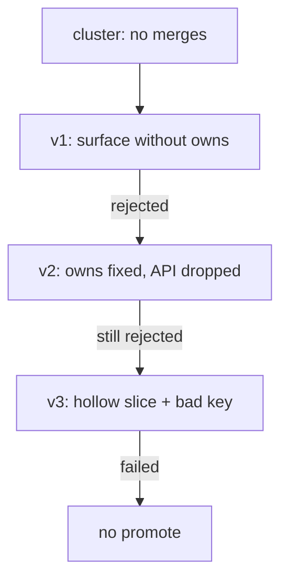
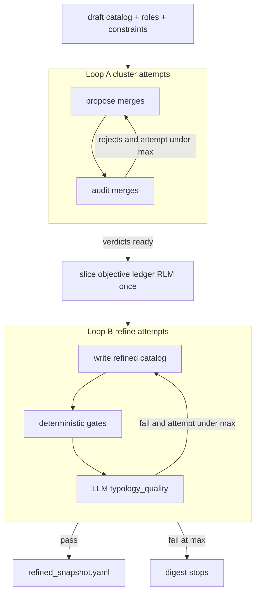
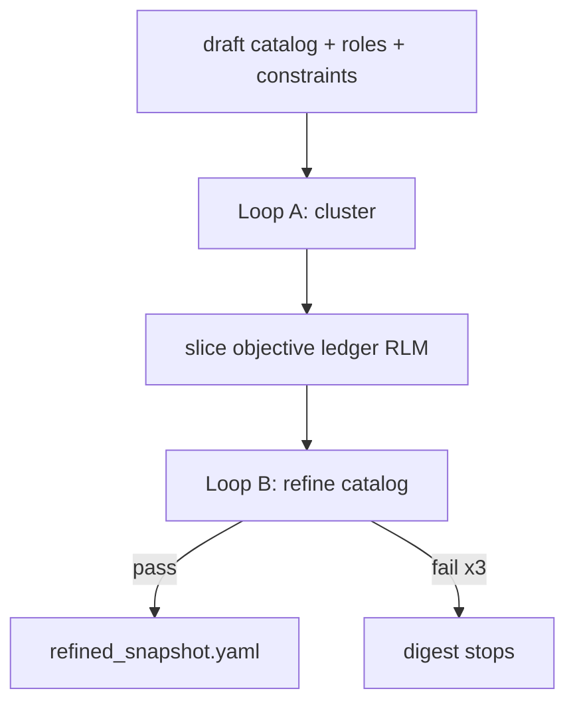

# Explain implementation

**Moral:** A developer must skim what landed or what a run did, and how the
pieces connect, without reading an essay. Prefer a tight visual layout over
paragraphs. Numbered steps MUST read like readable **pseudocode** (behavior,
decisions, skips), not like a narrative.

**Voice:** Still follow `.cursor/rules/always-rules-01-human-interaction.mdc`
for the rest of the turn (no icon-prefixed reply headings). For this explain
pass only, MUST prefer scannable structure over fluent multi-sentence prose.

---

## When to load

Load and follow this skill before the final user-facing reply when **any** of:

- You edited, created, or deleted project files to implement or fix something
- You are about to say the work is done, ready to commit, or ready to PR
- The user asks what you did, how it was built, or to explain the change
- The user asks to explain a finished run, pipeline trajectory, refine loop,
  evaluator path, or similar post-execution timeline

MUST NOT skip because the turn also ran tests or opened a PR.

MUST NOT load this skill for pure Q&A with no file changes and no finished-run
explain request (unless the user asks you to explain a prior implementation or
prior run).

---

## Tense mode

Pick one mode for the whole explain. MUST NOT mix present instruction verbs with
past execution verbs in the same step list.

| Mode | When | Verb tense | Parenthetical tense |
|------|------|------------|---------------------|
| **How it works** | Post-implement / how the change behaves | present (`write`, `skip`, `open`) | present or timeless (`proposal stays on…`) |
| **What ran** | Post-run trajectory already finished | past (`wrote`, `rejected`, `applied`, `skipped`) | past (`no folds applied`, `final, still rejected`) |

- Enforcement: Scan step verbs and parentheticals for tense agreement with the mode.
- Violation: STOP, rewrite the list into one mode, then send.

CORRECT (what ran, past):
```markdown
1. **Cluster** (no folds applied)
   IF `merge_*` were empty → applied no folds.
```

PROHIBITED (mixed / wrong parenthetical):
```markdown
1. **Cluster** (no folds to apply)
   IF `merge_*` empty → apply no folds.
```

PROHIBITED (ungrammatical):
```markdown
1. **Cluster** (no folds to applied)
```

---

## Core constraints

**CONSTRAINT:** The explain MUST be visual-first and short, using this DSL shape:

1. **Lead** — one or two short sentences: outcome only (what is different now, or what the run concluded).
2. **Section headings** — plain markdown headings for scan structure when the explain has more than a short step list (for example `Lead`, `Step-by-step (proposals → rejections)`, scores, evaluator next, `How it fits together`). MUST NOT use icon-prefixed headings.
3. **Pseudocode steps** — numbered `IF` / `ELSE` gates and concrete actions. Step titles MAY bold a phase name and MUST add a parenthetical **why it matters** when that is not obvious from the title alone.
4. **Diagram** — a small mermaid (or compact table) MAY replace the list or sit under `How it fits together` when the flow branches. When the explain shows **loops**, the diagram MUST make loop boundaries obvious (see Loop diagrams below).
5. **Authorship** — one line/bullet only if LLM vs mechanical could be confused; otherwise omit.
6. **Evidence** — optional short path list last.

- MUST: default to numbered IF/ELSE steps; use a diagram when it makes the path clearer.
- MUST: keep the explain scannable in a few seconds.
- MUST: keep each step concrete enough that a cold reader knows what happens without decoding jargon (split packed phrases into two steps when needed).
- MUST: put why-it-matters in parentheses on phase titles when useful (`Refine v3 (final, still rejected)`, `Cluster (no folds applied)`).
- MUST NOT: write paragraph essays, restated task fluff, or empty headings with no content under them.
- MUST NOT: replace the explain with only file names or SHAs.
- MUST NOT: pack several actions into one vague line (for example "open/restack PR base=default writing X").
- Enforcement: Lead is ≤2 short sentences; body uses headings + numbered steps and/or one small diagram; each step states one clear action or decision; parentheticals match tense mode.
- Violation: STOP, cut prose into lead + concrete steps (and/or tiny diagram), fix tense and parentheticals, then send.

CORRECT (how it works, present):
```markdown
Digest can promote a drifted confirmed typology catalog onto default via a product PR.

1. Finish context digest (proposal stays on `majordomo-context/…`).
2. IF survey mode ≠ reuse → skip.
3. IF refined catalog == confirmed `.typology/typology.yaml` (normalized) → skip.
4. ELSE write refined YAML into `.typology/typology.yaml` on branch `majordomo-typology/<repo>-update`.
5. Push that branch and open (or update) a product PR whose base is the default branch.
6. Do not auto-merge that product PR.

- Mechanical Go only (no new LLM); PR body reuses existing findings markdown.
```

CORRECT (what ran, past, with headings + parentheticals):
````markdown
## Lead

Refine never accepted a catalog. Final fail was a hollow `infrastructure` slice plus `aigateway` on a surface without matching `owns`. Promote never ran.

## Step-by-step (proposals → rejections)

1. **Cluster** (no folds applied)
   IF `merge_ids` / `merge_packages` / `merge_intents` were empty → applied no folds.

2. **Refine v1** (surface without ownership, plus extra slice noise)
   - Wrote `operations` with `operations-api` → `./internal/aigateway`.
   - IF `aigateway` was not in `operations.owns` → rejected.
   - Also invented `review-reporting`.

3. **Refine v2** (partial swing: ownership fixed, API surface dropped)
   - Put `aigateway` in `operations.owns`.
   - ELSE also dropped the API surface (only `operations-cli` remained) → still rejected.

4. **Refine v3** (final, still rejected)
   - Split adapters into new slice `infrastructure`.
   - IF owned packages landed under `libraries[].owns` (not slice `owns`) → rejected as hollow slice.
   - IF API landed under invalid key `surfaces_api` (not `surfaces`) AND was not in `operations.owns` → rejected.

## How it fits together


````

PROHIBITED (vague packed step):
```markdown
4. ELSE push `majordomo-typology/…-update` and open/restack PR base=default with `.typology/typology.yaml`.
```

PROHIBITED (narrative bullets without IF/ELSE or why-parentheticals):
```markdown
2. Refine v1
   - Kept operations with an API surface
   - Did not put aigateway in owns
   - Likely rejection theme: surface without ownership
```

PROHIBITED (prose wall):
```markdown
Digest can now open a product PR that promotes the refined typology catalog onto default when the confirmed catalog drifted. Usual digest still builds the proposal on the context branch. After that PR is opened, Go checks survey mode was reuse, compares confirmed vs refined YAML, and on drift force-pushes…
```

PROHIBITED (file dump):
```markdown
Changed typology_promote.go, run.go, poll.go.
Tests pass.
```

**CONSTRAINT:** MUST NOT use icon-prefixed headings (`✅`, `🔍`, `🧭`, `➡️`, `❓`). Plain section headings are allowed and preferred when the explain has multiple beats.

- Enforcement: Scan before send.
- Violation: Rewrite without icons; keep plain headings if they aid scanning.

**CONSTRAINT:** Steps MUST name one concrete behavior each (compare, write, skip, push, open; or past wrote, rejected, applied, skipped). Paths and branch names MAY appear, but the action MUST stay obvious. MUST NOT crush write + push + open into one opaque phrase.

- Enforcement: Read each step; ask whether a new teammate would know what git/forge or pipeline action happened.
- Violation: STOP, split or reword the step.

---

## Loop diagrams

**CONSTRAINT:** When a mermaid (or similar) diagram includes one or more loops, it MUST show **what is inside each loop** versus what runs once outside. A cold reader MUST NOT have to guess whether a middle step (for example ledger RLM) is inside Loop A, inside Loop B, or between them.

- MUST: draw each loop as a `subgraph` (or equivalent) whose **interior** lists the repeated steps.
- MUST: show the retry / feedback edge **inside** that subgraph (back to the start of the loop body), or an explicit `attempt < max` decision node inside it.
- MUST: place once-only steps **outside** every loop subgraph (between subgraphs or before/after).
- MUST NOT: use a single box labeled `Loop A: …` / `Loop B: …` with only straight-line arrows to neighbors (that hides membership).
- MUST NOT: imply the whole pipeline is one loop when only a subset retries.
- Enforcement: For every node labeled as a loop in the diagram, check a subgraph boundary and an in-subgraph retry edge (or in-subgraph attempt gate). Check once-only neighbors sit outside.
- Violation: STOP, redraw with subgraphs + retry edges, then send.

CORRECT (boundaries clear: ledger is outside both loops):


PROHIBITED (ambiguous: is ledger inside a loop? what retries?):


---

## Agent procedure

1. **Detect** — File-changing implement/fix, finished-run explain request, or user asked what you did / what happened.
2. **Pick tense mode** — how it works (present) vs what ran (past).
3. **Lead** — Outcome only.
4. **Headings + IF/ELSE steps** — Parenthetical why-it-matters on phase titles; add or swap in a small diagram when the flow is clearer that way; cut anything that does not help scanning.
5. **If diagram has loops** — Use subgraphs + in-loop retry edges; keep once-only steps outside.
6. **One authorship bullet** — Only if confusable.
7. **Optional paths** — Last, short.
8. **Stop** — No essay. One next-step question is fine.

---

## Pre-completion checklist

- [ ] **Visual-first:** Lead + numbered steps (diagram optional); headings OK; not a prose wall
      Method: Count long paragraphs in the explain
      Pass: At most one short lead; body is headings/steps and/or one small diagram
      Fail: STOP, convert to numbered steps (and/or tiny diagram)
- [ ] **Tense mode:** One mode for the whole list; parentheticals match
      Method: Scan verbs and `(…)` notes
      Pass: All present or all past as chosen
      Fail: STOP, rewrite into one mode
- [ ] **Why-parentheticals:** Phase titles that need “why it matters” have `(…)`
      Method: Skim step titles
      Pass: Non-obvious titles carry a short parenthetical
      Fail: STOP, add or fix parentheticals (past: `no folds applied`, not `to apply`)
- [ ] **Enough:** Cold reader gets what changed / what ran and how it fits
      Method: Skim-only test (~5 seconds)
      Pass: Both clear
      Fail: STOP, add the missing beat as a step
- [ ] **Not a file dump:** Behavior verbs present
      Method: Read steps
      Pass: System behavior first
      Fail: STOP, rewrite
- [ ] **Concrete steps:** No packed vague lines; each step is one clear action/decision
      Method: Teammate test on each step
      Pass: Action is obvious without decoding jargon
      Fail: STOP, split or reword
- [ ] **Loop diagram clarity:** If the diagram names loops, each has a subgraph + retry edge; once-only steps sit outside
      Method: Inspect mermaid for `subgraph` around each loop and feedback arrows; check neighbors like ledger
      Pass: Membership of each node is obvious
      Fail: STOP, redraw (no lone `Loop A` / `Loop B` boxes on a straight line)
- [ ] **No icon template / no fluff**
      Method: Scan
      Pass: Clean and short
      Fail: STOP, cut
